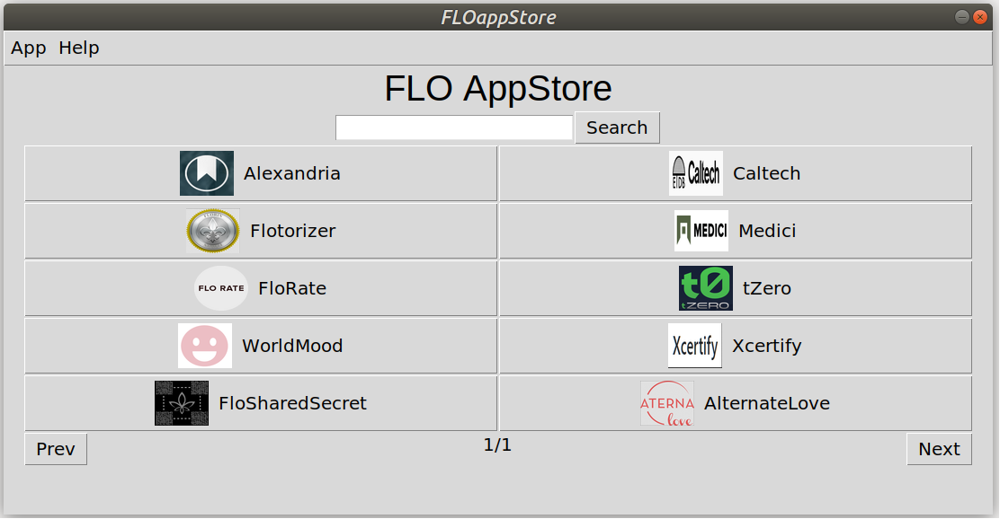

# FLO-AppStore
This is a Tkinter(Python 3) based gui app,which lets users to download/install,update,remove,execute and manage other FLO Dapps.The app reads the details of other dapps from Flo Blockchain.These details are added by the authoritative user by making transactions with the dapp details with his/her required address.A hash is calculated of the dapps details and is also stored in the blockchain.When the app is opened for the first time,all the details of dapps is fetched from flo blockchain(only transactions of type "vin" is considered for the specified/authoritative User address and is stored in local file along with the last txid fetched.The purpose of fetching the last txid is to optimize the time it takes while opening the app.The flostore app need not have to re-read all the transactions,instead it will start fetching details after the last txid fetched.Inorder to provide security of local data fetched in json format,the hash of local data stored is compared with the hash earlier stored in blockchain. 
The details are as follows 
id - App id
name - Name of the app
icon - Icon img location 
description - App Description
type - App type (webapp, cmdline or gui)
exec - Execution Command
github - github link

**Use generateAppData.py for generating the data required to send for the respective app**

Webapps are available as website n should be opened in browser
Gui apps are open by running their binary files
Cmdline apps are open in terminal using gnome-terminal by executing their cmd(binary)

In addition to those values the following values are also in json file, 
webapps url - url link to the website
Gui and Cmdline dapps :
github - GitHub repo link of the app
exec - execution cmd for the binary

A button for each app (with icon and app name) is generated for each app.The appstore shows 10 (5rows*2columns) apps per page.

## Requirements
1. Linux operating system(working on a cross platform version).
2. git (to install git):
		sudo apt-get install git
3. Internet
4. Flo Wallet(Running)

## Usage
1. Clone/download this repository. (https://github.com/ranchimall/FLO-appStore/)
2. Run the binary file (FLO_appStore)
		./FLO_appStore

3. For installing an dapp,user needs to click on respective app.A popup window will open which ask user to download the dapp if not previously installed.

4. Once installed the same popup window will have extra buttons to open/remove dapp.

5. Click on open app to open the Dapp

6. Updates for dapps are checked everytime when user is connected to Internet.Click on dapp which user want to update,if any updates are available,update button will automatically be displayed in the popup window.
7. For browser apps, open browser button will be shown instead of download/open buttons. Click on it to open the webpage in browser.

6. User can also search for any dapp in flostore using Search bar feature.

7. For navigating to other pages in Flostore,use Next/Prev Buttons.

## Other Infos

1. Source code of the AppStore is main.py
2. Apps are downloaded in the apps directory
3. Icons for the apps are stored in icon directory
4. On clicking the download button the appstore clones the app from the github repo.The appstore also removes files downloaded from wrong github repo.
5. If the app is downloaded already,open app button - executes the app using the app[exec] from json file.
6. Update app button - On clicking this button, the app data is 'pull'ed from the github repo. It also resets the app to the last commit preventing any malicious code affecting the app data ensuring safe and secure for the user
7. Remove app button - Removes the downloaded local repo (app data) of the app.
8. In addition to it,the appStore also updates itself from its repo for any changes in json in the blockchain or other updates.
**Do not remove the directories and/or files mannually**
